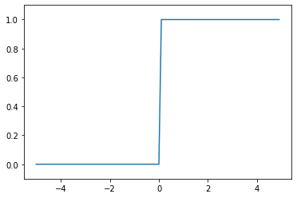
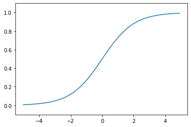

# 神经网络

&emsp;&emsp;上一章我们学习了感知机。关于感知机，既有好消息，也有坏消息。好消息是，即便对于复杂的函数，感知机也隐含着能够表示它的可能性。上一章已经介绍过，即便是计算机进行的复杂处理，感知机（理论上）也可以将其表示出来。坏消息是，设定权重的工作，即确定合适的、能符合预期的输入与输出的权重，现在还是由人工进行的。

&emsp;&emsp;神经网络的出现就是为了解决刚才的坏消息。具体地讲，神经网络的一个重要性质是它可以自动地从数据中学习到合适的权重参数。本章中，我们会先介绍神经网络的概要，然后重点关注神经网络进行识别时的处理。在下一章中，我们将了解如何从数据中学习权重参数。

## 从感知机到神经网络

&emsp;&emsp; 神经网络和上一章介绍的感知机有很多共同点。这里，我们主要以两者的差异为中心，来介绍神经网络的结构。

&emsp;&emsp; 用图来表示神经网络的话，如图3-1所示。我们把最左边的一列称为输入层，最右边的一列称为输出层，中间的一列称为中间层。中间层有时也称为隐藏层。“隐藏”一词的意思是，隐藏层的神经元（和输入层、输出层不同）肉眼看不见。另外，本书中把输入层到输出层依次称为第0层、第1层、第2层（层号之所以从0开始，是为了方便后面基于Python进行实现）。图3-1中，第0层对应输入层，第1层对应中间层，第2层对应输出层。


>图3-1中的网络一共由3层神经元构成，但实质上只有2层神经
元有权重，因此将其称为“2层网络”。请注意，有的书也会根据
构成网络的层数，把图3-1的网络称为“3层网络”。本书将根据
实质上拥有权重的层数（输入层、隐藏层、输出层的总数减去1
后的数量）来表示网络的名称。

>本书在使用“感知机”一词时，没有严格统一它所指的算法。一
般而言，“朴素感知机”是指单层网络，指的是激活函数使用了阶
跃函数
A  的模型。“多层感知机”是指神经网络，即使用sigmoid
函数（后述）等平滑的激活函数的多层网络。

## 激活函数

&emsp;&emsp;激活函数（activation function）会将输入信号的总和转换为输出信号。如“激活”一词所示，激活函数的作用在于决定如何来激活输入信号的总和。

&emsp;&emsp;如果激活函数以阈值为界，一旦输入超过阈值，就切换输出。这样的函数称为“阶跃函数”。因此，可以说感知机中使用了阶跃函数作为激活函数。也就是说，在激活函数的众多候选函数中，感知机使用了阶跃函数。那么，如果感知机使用其他函数作为激活函数的话会怎么样呢？实际上，如果将激活函数从阶跃函数换成其他函数，就可以进入神经网络的世界了。下面我们就来介绍一下神经网络使用的激活函数。

>阶跃函数是指一旦输入超过阈值，就切换输出的函数。

### sigmoid函数

&emsp;&emsp;神经网络中经常使用的一个激活函数就是sigmoid函数（sigmoid function）。

$$
h\left( x \right) =\frac{1}{1+\exp \left( -x \right)}
$$

&emsp;&emsp;神经网络中用sigmoid函数作为激活函数，进行信号的转换，转换后的信号被传送给下一个神经元。实际上，上一章介绍的感知机和接下来要介绍的神经网络的主要区别就在于这个激活函数。其他方面，比如神经元的多层连接的构造、信号的传递方法等，基本上和感知机是一样的。下面，让我们通过和阶跃函数的比较来详细学习作为激活函数的sigmoid函数。

### 阶跃函数的实现

&emsp;&emsp;这里我们试着用Python画出阶跃函数的图（从视觉上确认函数的形状对理解函数而言很重要）。阶跃函数如式（3.3）所示，当输入超过0时，输出1，否则输出0。可以像下面这样简单地实现阶跃函数。


```python
def step_function(x):
    if x>0:
        return 1 
    else:
        return 0 
```

&emsp;&emsp;这个实现简单、易于理解，但是参数 x 只能接受实数（浮点数）。也就是说，允许形如 step_function(3.0) 的调用，但不允许参数取NumPy数组，例如 step_function(np.array([1.0, 2.0])) 。为了便于后面的操作，我们把它修改为支持NumPy数组的实现。为此，可以考虑下述实现。


```python
def step_function(x):
    y=x>0
    return y.astype(np.int)
```

&emsp;&emsp;上述函数的内容只有两行。由于使用了NumPy中的“技巧”，可能会有点难理解。下面我们通过Python解释器的例子来看一下这里用了什么技巧。下面这个例子中准备了NumPy数组 x ，并对这个NumPy数组进行了不等号运算。


```python
import numpy as np 
x= np.array([-1.0,1.0,2.0])
x
```


    array([-1.,  1.,  2.])


```python
y=x>0 
y
```


    array([False,  True,  True])


&emsp;&emsp;对NumPy数组进行不等号运算后，数组的各个元素都会进行不等号运算，生成一个布尔型数组。这里，数组 x 中大于0的元素被转换为 True ，小于等于0的元素被转换为 False ，从而生成一个新的数组 y 。

&emsp;&emsp;数组 y 是一个布尔型数组，但是我们想要的阶跃函数是会输出 int 型的0或1的函数。因此，需要把数组 y 的元素类型从布尔型转换为 int 型。


```python
y= y.astype(np.int)
y
```


    array([0, 1, 1])


&emsp;&emsp; 如上所示，可以用 astype() 方法转换NumPy数组的类型。 astype() 方法通过参数指定期望的类型，这个例子中是 np.int 型。Python中将布尔型转换为 int 型后， True 会转换为1， False 会转换为0。以上就是阶跃函数的实现中所用到的NumPy的“技巧”

### 阶跃函数的图形

&emsp;&emsp; 下面我们就用图来表示上面定义的阶跃函数，为此需要使用 matplotlib 库。


```python
import numpy as np
import matplotlib.pylab as plt
def step_function(x):
    return np.array(x > 0, dtype=np.int)
x = np.arange(-5.0, 5.0, 0.1)
y = step_function(x)
plt.plot(x, y)
plt.ylim(-0.1, 1.1) # 指定y轴的范围
plt.show()
```





&emsp;&emsp;np.arange(-5.0, 5.0, 0.1) 在−5.0到5.0的范围内，以0.1为单位，生成NumPy数组 $([-5.0, -4.9, … , 4.9])$。step_function() 以该NumPy数组为参数，对数组的各个元素执行阶跃函数运算，并以数组形式返回运算结果。对数组 x 、 y 进行绘图，结果上图所示。<br>
&emsp;&emsp;阶跃函数以0为界，输出从0切换为1（或者从1切换为0）。它的值呈阶梯式变化，所以称为阶跃函数。

### sigmoid函数的实现

&emsp;&emsp;下面，我们来实现sigmoid函数。用Python可以像下面这样写出式（3.6）表示的sigmoid函数。


```python
def sigmoid(x):
    return 1/(1+np.exp(-x))
```

&emsp;&emsp;这里， np.exp(-x) 对应exp(−x)。这个实现没有什么特别难的地方，但是要注意参数 x 为NumPy数组时，结果也能被正确计算。实际上，如果在这个sigmoid函数中输入一个NumPy数组，则结果如下所示。


```python
x=np.array([-1.0,1.0,2.0])
sigmoid(x)
```


    array([0.26894142, 0.73105858, 0.88079708])


&emsp;&emsp;之所以sigmoid函数的实现能支持NumPy数组，秘密就在于NumPy的广播功能（1.5.5节）。根据NumPy 的广播功能，如果在标量和NumPy数组
之间进行运算，则标量会和NumPy数组的各个元素进行运算。这里来看一
个具体的例子。


```python
t=np.array([1.0,2.0,3.0])
1.0+t ,1.0/t
```


    (array([2., 3., 4.]), array([1.        , 0.5       , 0.33333333]))


&emsp;&emsp;在这个例子中，标量（例子中是 1.0 ）和NumPy数组之间进行了数值运算（+、/等）。结果，标量和NumPy数组的各个元素进行了运算，运算结果以NumPy数组的形式被输出。刚才的sigmoid函数的实现也是如此，因为 np.exp(-x) 会生成NumPy数组，所以 1 / (1 + np.exp(-x)) 的运算将会在NumPy数组的各个元素间进行。

&emsp;&emsp;下面我们把sigmoid函数画在图上。画图的代码和刚才的阶跃函数的代码几乎是一样的，唯一不同的地方是把输出 y 的函数换成了sigmoid函数。


```python
x=np.arange(-5.0,5.0,0.1)
y=sigmoid(x)
plt.plot(x, y)
plt.ylim(-0.1, 1.1) # 指定y轴的范围
plt.show()
```





### ReLU 函数

&emsp;&emsp;ReLU函数在输入大于0时，直接输出该值；在输入小于等于0时，输出0


```python
def relu(x):
    return np.maximum(0,x)
```

&emsp;&emsp; 这里使用了NumPy的 maximum 函数。 maximum 函数会从输入的数值中选择较大的那个值进行输出。

## 多维数组的运算

&emsp;&emsp;如果掌握了NumPy多维数组的运算，就可以高效地实现神经网络。因此，本节将介绍NumPy多维数组的运算，然后再进行神经网络的实现。

### 多维数组

&emsp;&emsp;简单地讲，多维数组就是“数字的集合”，数字排成一列的集合、排成长方形的集合、排成三维状或者（更加一般化的）N维状的集合都称为多维数组。下面我们就用NumPy来生成多维数组，先从前面介绍过的一维数组开始。


```python
import numpy as np
A=np.array([1,2,3,4])
print(A) 
np.ndim(A)  #获得数组的维度
```

    [1 2 3 4]
    


    1


```python
A.shape,A.shape[0]
```


    ((4,), 4)


&emsp;&emsp;如上所示，数组的维数可以通过 np.dim() 函数获得。此外，数组的形状可以通过实例变量 shape 获得。在上面的例子中， A 是一维数组，由4个元素构成。注意，这里的 A.shape 的结果是个元组（tuple）。这是因为一维数组的情况下也要返回和多维数组的情况下一致的结果。例如，二维数组时返回的是元组 (4,3) ，三维数组时返回的是元组 (4,3,2) ，因此一维数组时也同样以元组的形式返回结果。下面我们来生成一个二维数组。


```python
B=np.array([[1,2],[3,4],[5,6]])
print(B)
np.ndim(B),B.shape
```

    [[1 2]
     [3 4]
     [5 6]]
    


    (2, (3, 2))


&emsp;&emsp;这里生成了一个3 × 2的数组 B 。3 × 2的数组表示第一个维度有3个元素，第二个维度有2个元素。另外，第一个维度对应第0维，第二个维度对应第1维（Python的索引从0开始）。二维数组也称为**矩阵**（matrix）。如图3-10所示，数组的横向排列称为**行**（row），纵向排列称为**列**（column）。

###  矩阵乘法

&emsp;&emsp; 矩阵的乘积是通过左边矩阵的行（横向）和右边矩阵的列（纵
向）以对应元素的方式相乘后再求和而得到的。并且，运算的结果保存为新
的多维数组的元素。比如，A的第1行和B的第1列的乘积结果是新数组的
第1行第1列的元素，A的第2行和B的第1列的结果是新数组的第2行第1
列的元素。另外，在本书的数学标记中，矩阵将用黑斜体表示（比如，矩阵
A），以区别于单个元素的标量（比如，a或b）。这个运算在Python中可以用
如下代码实现。


```python
A=np.array([[1,2],[3,4]])
B=np.array([[5,6],[7,8]])
A.shape,B.shape
```


    ((2, 2), (2, 2))


```python
np.dot(A,B) #计算乘法， 注意A*B和B*A结果不同
```


    array([[19, 22],
           [43, 50]])


&emsp;&emsp; 这里，A和B都是2 × 2的矩阵，它们的乘积可以通过NumPy的np.dot() 函数计算（乘积也称为点积）。 np.dot() 接收两个NumPy数组作为参数，并返回数组的乘积。这里要注意的是， np.dot(A, B) 和 np.dot(B, A) 的值可能不一样。和一般的运算（ + 或 * 等）不同，矩阵的乘积运算中，操作数（ A、B ）的顺序不同，结果也会不同。

&emsp;&emsp;这里介绍的是计算2 × 2形状的矩阵的乘积的例子，其他形状的矩阵的乘积也可以用相同的方法来计算。比如，2 × 3的矩阵和3 × 2 的矩阵的乘积可按如下形式用Python来实现。


```python
A=np.array([[1,2,3],[4,5,6]])
B=np.array([[1,2],[3,4],[5,6]])
A.shape,B.shape
```


    ((2, 3), (3, 2))


```python
np.dot(A,B)
```


    array([[22, 28],
           [49, 64]])


&emsp;&emsp; 2 × 3的矩阵A和3 × 2的矩阵B的乘积可按以上方式实现。这里需要注意的是矩阵的形状（ shape ）。具体地讲，矩阵A的第1维的元素个数（列数）必须和矩阵B的第0维的元素个数（行数）相等。在上面的例子中，矩阵A的形状是2 × 3，矩阵B的形状是3 × 2，矩阵A的第1维的元素个数（3）和矩阵B的第0维的元素个数（3）相等。如果这两个值不相等，则无法计算矩阵的乘积。比如，如果用Python计算2 × 3 的矩阵A和2 × 2的矩阵C的乘积，则会输出如下错误。
<br>Traceback (most recent call last):
File "<stdin>", line 1, in <module>
ValueError: shapes (2,3) and (2,2) not aligned: 3 (dim 1) != 2 (dim 0)

&emsp;&emsp;这个错误的意思是，矩阵A的第1维和矩阵C的第0维的元素个数不一致（维度的索引从0开始）。也就是说，在多维数组的乘积运算中，必须使两个矩阵中的对应维度的元素个数一致，这一点很重要。我们通过图3-12再来确认一下。

### 神经网络的内积

&emsp;&emsp;下面我们使用NumPy矩阵来实现神经网络。这里我们以图3-14中的简单神经网络为对象。这个神经网络省略了偏置和激活函数，只有权重。


&emsp;&emsp;实现该神经网络时，要注意X、W、Y的形状，特别是X和W的对应维度的元素个数是否一致，这一点很重要。


```python
X=np.array([1,2])
W=np.array([[1,3,5],[2,4,6]])
print(X)
print(W)
X.shape,W.shape
```

    [1 2]
    [[1 3 5]
     [2 4 6]]
    


    ((2,), (2, 3))


```python
Y=np.dot(X,W)
Y
```


    array([ 5, 11, 17])


&emsp;&emsp;如上所示，使用 np.dot （多维数组的点积），可以一次性计算出Y 的结果。这意味着，即便Y 的元素个数为 100 或 1000 ，也可以通过一次运算就计算出结果！如果不使用 np.dot ，就必须单独计算Y 的每一个元素（或者说必须使用 for 语句），非常麻烦。因此，通过矩阵的乘积一次性完成计算的技巧，在实现的层面上可以说是非常重要的。

## 3层神经网络的实现

### 各层间信号传递的实现

&emsp;&emsp;现在看一下从输入层到第1层的第1个神经元的信号传递过程，如图3-17所示。


&emsp;&emsp;图3-17中增加了表示偏置的神经元“1”。请注意，偏置的右下角的索引号只有一个。这是因为前一层的偏置神经元（神经元“1”）只有一个A 。

&emsp;&emsp;为了确认前面的内容，现在用数学式表示 。 通过加权信号和偏置的和按如下方式进行计算

$$
a_{1}^{\left( 1 \right)}=w_{11}^{\left( 1 \right)}x_1+w_{12}^{\left( 1 \right)}x_2+b_{1}^{\left( 1 \right)}
$$


&emsp;&emsp;此外，如果使用矩阵的乘法运算，则可以将第1层的加权和表示成下面的式

$$
A_{}^{\left( 1 \right)}=XW^{\left( 1 \right)}+B^{\left( 1 \right)}
$$


&emsp;&emsp; 其中，
$
A^{\left( 1 \right)}=\left( a_{1}^{\left( 1 \right)}\ a_{2}^{\left( 1 \right)}\ a_{3}^{\left( 1 \right)} \right) ,\ X=\left( x_1\ x_2 \right) ,\ B^{\left( 1 \right)}=\left( b_{1}^{\left( 1 \right)}\ b_{2}^{\left( 1 \right)}\ b_{3}^{\left( 1 \right)} \right) \ 
$
$$
W^{\left( 1 \right)}=\left( \begin{array}{c}
	w_{11}^{\left( 1 \right)}\ w_{21}^{\left( 1 \right)}\ w_{31}^{\left( 1 \right)}\\
	w_{12}^{\left( 1 \right)}\ w_{22}^{\left( 1 \right)}\ w_{32}^{\left( 1 \right)}\\
\end{array} \right) 
$$


&emsp;&emsp; 下面我们用NumPy多维数组来实现，这里将输入信号、权重、
偏置设置成任意值。


```python
X=np.array([1.0,0.5])
W1=np.array([[0.1,0.3,0.5],[0.2,0.4,0.6]])
B1=np.array([0.1,0.2,0.3])
print(W1.shape,X.shape,B1.shape)
```

    (2, 3) (2,) (3,)
    

&emsp;&emsp;这个运算和上一节进行的运算是一样的。 W1 是2 × 3的数组， X 是元素个数为2的一维数组。这里， W1 和 X 的对应维度的元素个数也保持了一致。

&emsp;&emsp;接下来，我们观察第1层中激活函数的计算过程。如果把这个计算过程用图来表示的话，则如图3-18所示。

&emsp;&emsp;

&emsp;&emsp;如图3-18所示，隐藏层的加权和（加权信号和偏置的总和）用a表示，被激活函数转换后的信号用z表示。此外，图中h()表示激活函数，这里我们使用的是sigmoid函数。用Python来实现，代码如下所示。


```python
A1=np.dot(X,W1)+B1
Z1=sigmoid(A1)
print(A1,Z1)
```

    [0.3 0.7 1.1] [0.57444252 0.66818777 0.75026011]
    

&emsp;&emsp;这个 sigmoid() 函数就是之前定义的那个函数。它会接收NumPy数组，并返回元素个数相同的NumPy数组。

***

&emsp;&emsp;下面，我们来实现第1层到第2层的信号传递（图3-19）。


```python
W2 = np.array([[0.1, 0.4], [0.2, 0.5], [0.3, 0.6]])
B2 = np.array([0.1, 0.2])
print(Z1.shape) # (3,)
print(W2.shape) # (3, 2)
print(B2.shape) # (2,)

A2 = np.dot(Z1, W2) + B2
Z2 = sigmoid(A2)
```

    (3,)
    (3, 2)
    (2,)
    

&emsp;&emsp;

&emsp;&emsp;除了第1层的输出（ Z1 ）变成了第2层的输入这一点以外，这个实现和刚才的代码完全相同。由此可知，通过使用NumPy数组，可以将层到层的信号传递过程简单地写出来。


&emsp;&emsp;最后是第2层到输出层的信号传递（图3-20）。输出层的实现也和之前的实现基本相同。不过，最后的激活函数和之前的隐藏层有所不同。


```python
def identity_function(x):
    return x

W3 = np.array([[0.1, 0.3], [0.2, 0.4]])
B3 = np.array([0.1, 0.2])
A3 = np.dot(Z2, W3) + B3
Y = identity_function(A3) # 或者Y = A3
```

&emsp;&emsp;这里我们定义了 identity_function() 函数（也称为“恒等函数”），并将其作为输出层的激活函数。恒等函数会将输入按原样输出，因此，这个例子中没有必要特意定义 identity_function() 。这里这样实现只是为了和之前的流程保持统一。另外，图3-20中，输出层的激活函数用σ()表示，不同于隐藏层的激活函数h()（σ读作sigma）。


> 输出层所用的激活函数，要根据求解问题的性质决定。一般地，回
归问题可以使用恒等函数，二元分类问题可以使用sigmoid函数，
多元分类问题可以使用softmax函数。关于输出层的激活函数，我
们将在下一节详细介绍。

### 代码实现小结

&emsp;&emsp;至此，我们已经介绍完了3层神经网络的实现。现在我们把之前的代码实现全部整理一下。这里，我们按照神经网络的实现惯例，只把权重记为大写字母 W1 ，其他的（偏置或中间结果等）都用小写字母表示。


```python
def init_network():
    network = {}
    network['W1'] = np.array([[0.1, 0.3, 0.5], [0.2, 0.4, 0.6]])
    network['b1'] = np.array([0.1, 0.2, 0.3])
    network['W2'] = np.array([[0.1, 0.4], [0.2, 0.5], [0.3, 0.6]])
    network['b2'] = np.array([0.1, 0.2])
    network['W3'] = np.array([[0.1, 0.3], [0.2, 0.4]])
    network['b3'] = np.array([0.1, 0.2])
    
    return network

def forward(network, x):
    W1, W2, W3 = network['W1'], network['W2'], network['W3']
    b1, b2, b3 = network['b1'], network['b2'], network['b3']
    a1 = np.dot(x, W1) + b1
    z1 = sigmoid(a1)
    a2 = np.dot(z1, W2) + b2
    z2 = sigmoid(a2)
    a3 = np.dot(z2, W3) + b3
    y = identity_function(a3)
    
    return y

network = init_network()
x = np.array([1.0, 0.5])
y = forward(network, x)
print(y) # [ 0.31682708 0.69627909]
```

    [0.31682708 0.69627909]
    

&emsp;&emsp;这里定义了 init_network() 和 forward() 函数。 init_network() 函数会进行权重和偏置的初始化，并将它们保存在字典变量 network 中。这个字典变量 network 中保存了每一层所需的参数（权重和偏置）。 forward() 函数中则封装了将输入信号转换为输出信号的处理过程。

&emsp;&emsp;另外，这里出现了forward（前向）一词，它表示的是从输入到输出方向的传递处理。后面在进行神经网络的训练时，我们将介绍后向（backward，从输出到输入方向）的处理。

&emsp;&emsp;至此，神经网络的前向处理的实现就完成了。通过巧妙地使用NumPy多维数组，我们高效地实现了神经网络

## 输出层的设计

&emsp;&emsp;神经网络可以用在分类问题和回归问题上，不过需要根据情况改变输出层的激活函数。一般而言，回归问题用恒等函数，分类问题用softmax函数。

>机器学习的问题大致可以分为分类问题和回归问题。分类问题是数
据属于哪一个类别的问题。比如，区分图像中的人是男性还是女性
的问题就是分类问题。而回归问题是根据某个输入预测一个（连续的）
数值的问题。比如，根据一个人的图像预测这个人的体重的问题就
是回归问题（类似“57.4kg”这样的预测）。

### 恒等函数和softmax函数

&emsp;&emsp;恒等函数会将输入按原样输出，对于输入的信息，不加以任何改动地直接输出。因此，在输出层使用恒等函数时，输入信号会原封不动地被输出。和前面介绍的隐藏层的激活函数一样，恒等函数进行的转换处理可以用一根箭头来表示。

&emsp;&emsp;分类问题中使用的softmax函数可以用下面的式表示

$$
y_k=\frac{\exp \left( a_k \right)}{\sum_{i=1}^n{\exp \left( a_1 \right)}}
$$


&emsp;&emsp;softmax函数的分子是输入信号a k 的指数函数，分母是所有输入信号的指数函数的和。用图表示softmax函数的话，如图3-22所示。图3-22中，softmax函数的输出通过箭头与所有的输入信号相连。这是因为，从上式可以看出，输出层的各个神经元都受到所有输入信号的影响。


&emsp;&emsp;

&emsp;&emsp;
